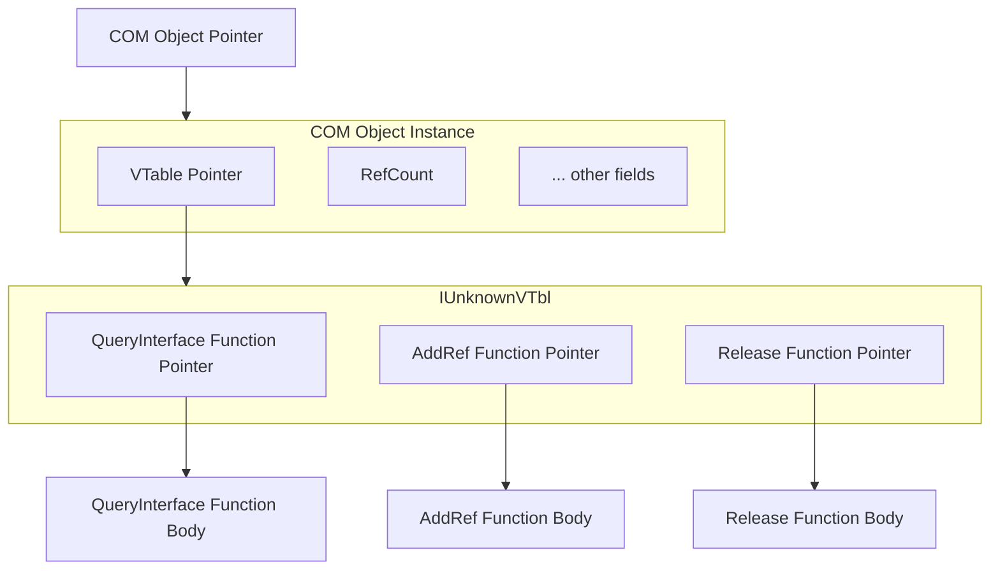

# Minimum COM

## Cpp Server and CSharp Client

To create a minimum in-proc COM server/client using C++ and CSharp,
we start by only caring about COM object ABI, thus directly provide a method to create the COM object in the C++ server and expose it to the CSharp client.

Firstly we focus on implementation part, and directly using C#'s standard Marshal APIs to interop with the COM object.

At the minimum, a COM object implements the IUnknown interface,
the ABI is about what's IUnknown and what `implement` mean.

The ABI of a `IUnknown` object is a simply a pointer which points to a memory block,
with starting field is a pointer to the `IUnknownVTbl` structure,
which in turn contains function pointers for the three IUnknown methods: `QueryInterface`, `AddRef`, and `Release`.

## IUnknown Object Structure

This diagram shows:
- **COM Object Pointer**: What the client receives - a pointer to the COM object
- **COM Object Instance**: The actual object in memory containing the VTable pointer and data
- **IUnknownVTbl**: The virtual table containing function pointers
- **Function Implementations**: The actual code that gets executed when methods are called

Historically COM's ABI is designed based on the assumption that among all major cpp compilers,
1. All types in C-style type system could be represented uniformly, thus struct layout is consistent
2. All functions arguments could be passed uniformly, i.e. support a specific calling convention
3. (Core design of COM) All cpp compilers implement the virtual function call mechanism equivalently,
more specifically, only requires for classes that have no data members
and with at most one base class that also has no data members.
